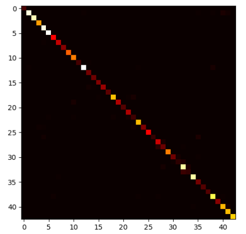

# Traffic Sign Recognition

#### Description

In this project I built a 97% accurate classifier for street sign recognition. I used the large German Traffic Sign Recognition Benchmark data set https://www.kaggle.com/meowmeowmeowmeowmeow/gtsrb-german-traffic-sign which contains over 40 classes for training a convolutional neural network.

#### Training Results

After training 800 epochs using 30% of the data for validation, I obtained a validation accuracy of 97%.

The following confusion matrix shows the predictions of the network:

As seen, the classifier is very robust, due to nearly zero entries on the side diagonals.

The classification report:

            	precision    recall  f1-score   support
           0       1.00      1.00      1.00        84
           1       0.98      0.96      0.97       888
           2       1.00      1.00      1.00       804
           3       0.98      0.99      0.99       528
           4       0.98      1.00      0.99       840
           5       1.00      1.00      1.00       864
           6       0.97      1.00      0.99       312
           7       0.96      0.96      0.96       252
           8       0.99      0.99      0.99       168
           9       1.00      1.00      1.00       444
          10       0.96      1.00      0.98       480
          11       1.00      0.94      0.97        84
          12       0.99      0.97      0.98       900
          13       0.91      0.96      0.93       144
          14       0.96      0.99      0.98       132
          15       0.97      1.00      0.98       156
          16       0.99      0.93      0.96       204
          17       0.96      0.98      0.97       108
          18       0.99      0.95      0.97       600
          19       0.99      0.93      0.96       240
          20       0.99      1.00      0.99        96
          21       0.93      1.00      0.96       216
          22       0.76      0.74      0.75       108
          23       0.99      1.00      0.99       564
          24       1.00      0.87      0.93       180
          25       0.98      1.00      0.99       312
          26       1.00      0.69      0.81        96
          27       0.88      0.92      0.90       275
          28       0.80      0.81      0.80       168
          29       0.99      1.00      0.99       480
          30       0.95      0.88      0.92       156
          31       0.79      0.65      0.71        84
          32       0.91      0.96      0.93       828
          33       0.80      0.58      0.67       120
          34       0.99      0.99      0.99       792
          35       0.82      0.97      0.89       144
          36       1.00      1.00      1.00        96
          37       0.99      1.00      0.99        96
          38       0.97      0.97      0.97       744
          39       1.00      0.98      0.99       168
          40       0.96      0.97      0.96       576
          41       0.96      0.99      0.98       564
          42       0.99      1.00      1.00       588
    
    accuracy                           0.97     15683
    macro avg       0.95      0.94      0.95     15683
    weighted avg       0.97      0.97      0.97     15683
shows that there are some classes, not recognized well (e.g 31), but this correlates directly with the lack of training data supporting this class. Except for the underrepresented classes, the prediction values are very good.
